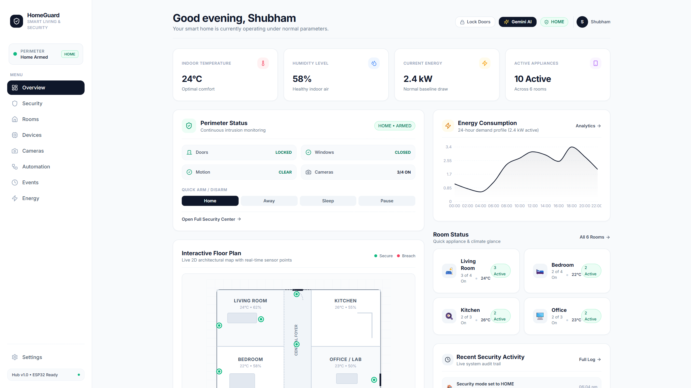
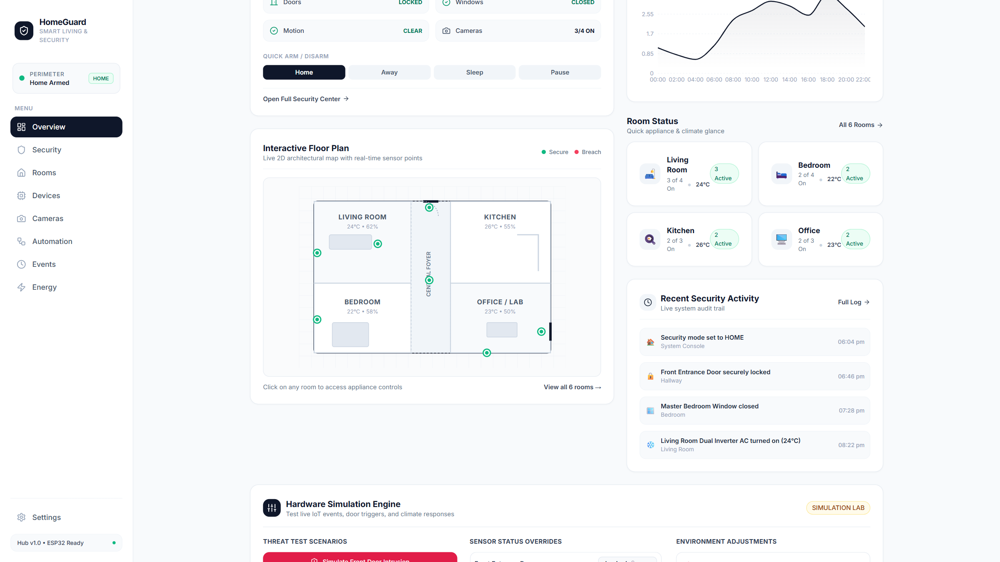
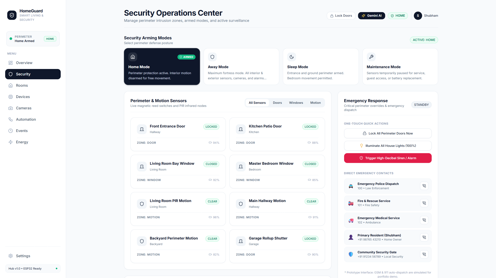
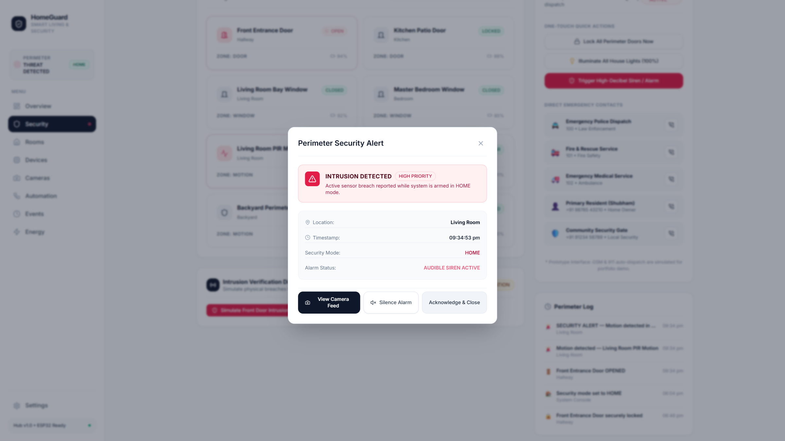
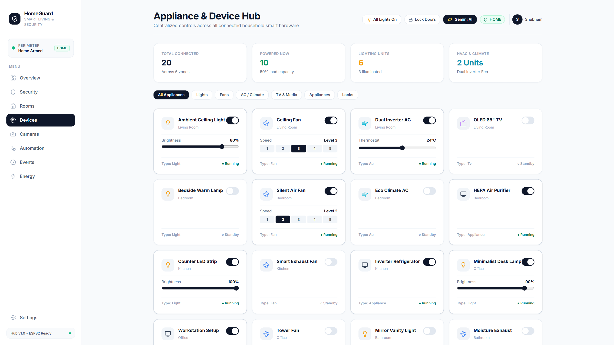
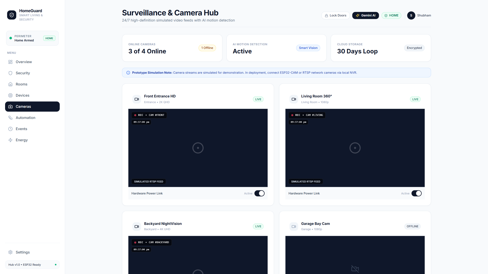
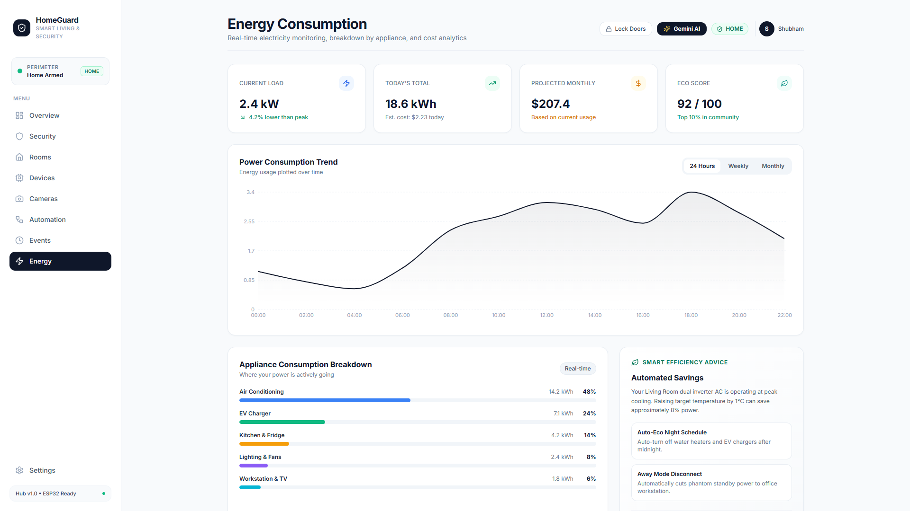

# 🏠 HomeGuard — Smart Living. Safer Home.

[](https://react.dev/)
[](https://vitejs.dev/)
[](https://tailwindcss.com/)
[](https://ai.google.dev/)
[](LICENSE)
[](https://homeguard-app.vercel.app/)

> A modern, premium **Smart Home + Theft Protection** platform built with a minimalist **White UI design system**, multi-page navigation, IoT simulation engine, and integrated **Gemini AI Security Copilot**.

---

### 🌐 Live Production Deployment
* 🔗 **Live Application URL**: [https://homeguard-app.vercel.app/](https://homeguard-app.vercel.app/)
* ⚡ **Hosting**: Vercel Edge Network with automatic continuous deployment from `main`.

---

## 🎬 Official Cinematic Product Launch Video

Experience HomeGuard in action through our 84-second cinematic product film:

[](docs/video/homeguard_cinematic_launch.mp4)

> 📹 **Watch or Download Full Video**: [`docs/video/homeguard_cinematic_launch.mp4`](docs/video/homeguard_cinematic_launch.mp4) (Full HD 1080p, 84 seconds, H.264 + AAC Audio)

---

## 📸 High-Resolution UI Screenshots

### 1. Situational Dashboard & Overview
The central cockpit displaying current armed mode, environmental vitals, real-time perimeter status, 24h energy load, and the hardware simulation engine.


---

### 2. Interactive 2D Architectural Floor Plan
Detailed architectural SVG blueprint with live interactive magnetic reed switch and PIR motion sensor pins.



---

### 3. Security Operations Center & Mode Selector
Stance selector (`HOME`, `AWAY`, `SLEEP`, `MAINTENANCE`), perimeter sensor matrix, threat verification diagnostics, and direct emergency contacts.



---

### 4. Instant Intrusion Verification & Security Alert Modal
High-priority breach alert modal triggered upon perimeter compromise, displaying breach location, timestamp, live camera view, and siren controls.



---

### 5. Smart Home Device & Appliance Hub
Comprehensive control for dimmable lighting, multi-speed fans, dual-inverter climate thermostats (16°C – 30°C), televisions, and smart deadbolt locks.



---

### 6. Multi-Camera RTSP Surveillance Grid
4 active surveillance feeds (Front Walkway HD, Living Room 360°, Backyard NightVision, Garage Bay) with running timestamps and snapshot capabilities.



---

### 7. Real-Time Energy Telemetry & Consumption
24-hour load curves, appliance breakdown metrics, projected monthly bills, and household Eco Efficiency scoring.



---

## 🧭 Multi-Page Architecture

The platform is organized across **9 dedicated pages**:

| Route | Page | Purpose & Key Features |
| :--- | :--- | :--- |
| `/` | **Overview** | Instant situational awareness, 4 real-time metric cards, perimeter status, 2D architectural SVG floor plan, 24h energy load, and Hardware Simulation Lab. |
| `/security` | **Security Center** | Arming stance selector (`HOME`, `AWAY`, `SLEEP`, `MAINTENANCE`), sensor matrix with filter tabs, SOS alarm overrides, and emergency contact dispatch. |
| `/rooms` | **Rooms** | 6 individual zones (**Living Room**, **Bedroom**, **Kitchen**, **Office**, **Bathroom**, **Garage**) with climate telemetry, light counts, and room management modals. |
| `/devices` | **Devices** | Centralized appliance hub categorized by *Lights*, *Fans*, *AC / Climate*, *TV*, *Appliances*, and *Locks* with continuous brightness, speed, and thermostat sliders. |
| `/cameras` | **Cameras** | 4 simulated RTSP surveillance feeds (**Front Entrance HD**, **Living Room 360°**, **Backyard NightVision**, **Garage Bay**) with running clock, REC overlay, snapshot capture, and fullscreen modal. |
| `/automation` | **Automation** | Conditional smart routines (*Night Lockdown*, *Away Fortress*, *Welcome Home*) with `IF` triggers and `THEN` execution lists, plus a custom Rule Builder. |
| `/events` | **Security Events** | Chronological audit trail and hybrid timeline/table with category filters (*All*, *Security*, *Doors*, *Windows*, *Motion*, *Devices*), search, and CSV export simulation. |
| `/energy` | **Energy Analytics** | Comprehensive power intelligence with 24-hour, weekly, and monthly consumption charts, appliance breakdown percentages, projected billing, and Eco Score. |
| `/settings` | **Settings** | Household profile management, push notification and siren sound toggles, default security stance, and ESP32 IoT hardware bridge configuration. |

---

## ✨ Core Capabilities

### 1. 🤖 Gemini AI Security Copilot
* Integrated directly into the top header via the **`✨ Gemini AI`** button.
* **Context Awareness**: Queries live perimeter state, active alarms, environmental metrics, and room devices.
* **Natural Language Voice/Chat Control**:
  * *"Audit my perimeter security"* ➔ Scans all doors, windows, and PIR motion nodes.
  * *"Lock down home and set to Away mode"* ➔ Executes emergency lockdown sequence in real-time.
  * *"Turn on all lights"* ➔ Illuminates every room to 100% brightness.
  * *"Analyze energy consumption"* ➔ Identifies top energy consumers and suggests savings.

### 2. 🔐 Theft Protection System
* **4 Security Modes**:
  * **Home**: Perimeter doors and windows armed; interior motion disarmed.
  * **Away**: Maximum fortress posture; all internal and external sensors, cameras, and alarms primed.
  * **Sleep**: Night perimeter armed; bedrooms relaxed for free movement.
  * **Maintenance**: Sensors paused for maintenance or guest access.
* **Intrusion Alerts & Alarm Protocol**:
  * Clean breach banner and modal with breach timestamp, sensor ID, and location.
  * One-touch **"View Camera"** and **"Silence Alarm"** controls.
* **Emergency Response**:
  * Instant lockdown for all doors and garage shutters.
  * Immediate illumination of all indoor and outdoor floodlights.
  * Direct emergency contacts for Police (100), Fire (101), Ambulance (102), and Community Guards.

### 3. 💡 Smart Home & Climate Controls
* **Dimmable Lighting**: Smooth brightness sliders (0% – 100%).
* **Speed Fans**: 5-level discrete speed selection.
* **Dual Inverter Climate**: Thermostat range (16°C – 30°C) with `Cool`, `Heat`, and `Auto` modes.
* **Smart Deadbolts**: Instant perimeter locking with visual confirmation.

---

## 🛠️ Technology Stack

* **Frontend**: React 18 (Vite SPA)
* **Styling**: Tailwind CSS (White UI Design System)
* **Icons**: Lucide React
* **Charts**: Recharts (Energy telemetry & power load curves)
* **Routing**: React Router DOM v6
* **State Management**: React Context (`HomeContext`) with persistent localStorage
* **AI Integration**: Google Gemini API via SDK
* **Production Deployment**: Vercel Edge Network

---

## 🚀 Local Development Setup

1. **Clone the repository**:
   ```bash
   git clone https://github.com/shubhamkerure07/HomeGuard.git
   cd HomeGuard
   ```

2. **Install dependencies**:
   ```bash
   npm install
   ```

3. **Start local Vite development server**:
   ```bash
   npm run dev
   ```
   Open `http://localhost:5173` in your browser.

4. **Production Build**:
   ```bash
   npm run build
   ```

---

## 📄 License
MIT License. See [LICENSE](LICENSE) for details.
